# Trails and Miles

**AI-powered travel planning platform for Indian travellers** — destination intelligence, smart itinerary builder, AI chatbot, and visa hub, all contextualized for India.

Built with Next.js 16, React 19, OpenAI GPT-4o, Prisma 7, and TailwindCSS 4.

---

## Table of Contents

- [Overview](#overview)
- [Architecture](#architecture)
- [Tech Stack](#tech-stack)
- [Project Structure](#project-structure)
- [Data Flow](#data-flow)
- [API Routes](#api-routes)
- [Frontend Pages](#frontend-pages)
- [AI Pipeline](#ai-pipeline)
- [Database Schema](#database-schema)
- [Getting Started](#getting-started)
- [Scripts](#scripts)
- [Deployment](#deployment)
- [Roadmap](#roadmap)

---

## Overview

Trails and Miles helps Indian travellers (aged 22–45) plan international and domestic trips with:

- **Destination Intelligence Hub** — Country and city pages with POIs, budgets, safety tips, and local transport info for 6 countries and 36+ cities
- **AI Itinerary Builder** — GPT-4o generates day-wise plans (morning/afternoon/evening blocks) with real POI data grounding
- **AI Chatbot** — RAG-powered conversational assistant with SSE streaming, grounded in destination database
- **Visa Hub** — India-passport-specific visa requirements with document checklists
- **India Domestic Travel** — 25 Indian cities, weekend getaways from 6 metros, festival calendar, train routes
- **Blog Engine** — SEO-first travel guides and articles

### Target Users

| Persona | Age | Needs |
|---------|-----|-------|
| Aarav | 26 | First-time international traveller — guided builder + visa clarity |
| Priya | 32 | Experienced explorer — novel experiences + personalization |
| Rajesh & Family | 40 | Comfort seekers — family-friendly filters + budget planning |

---

## Architecture

### High-Level System Architecture

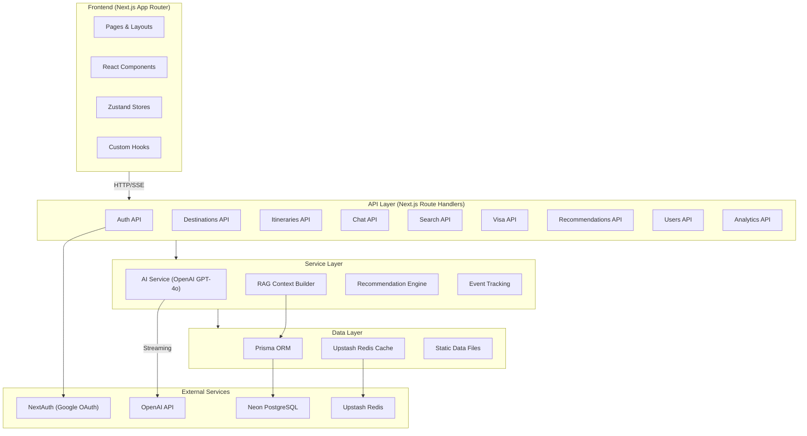

### Request Flow

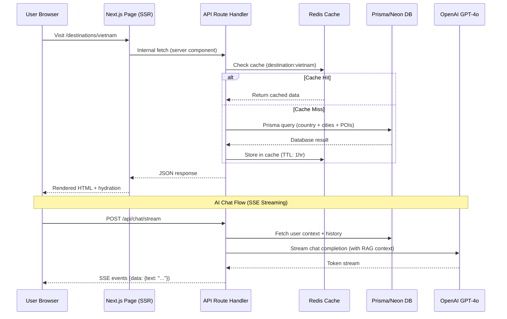

### AI Itinerary Generation Flow

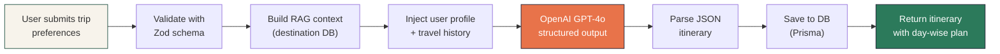

### Recommendation Pipeline

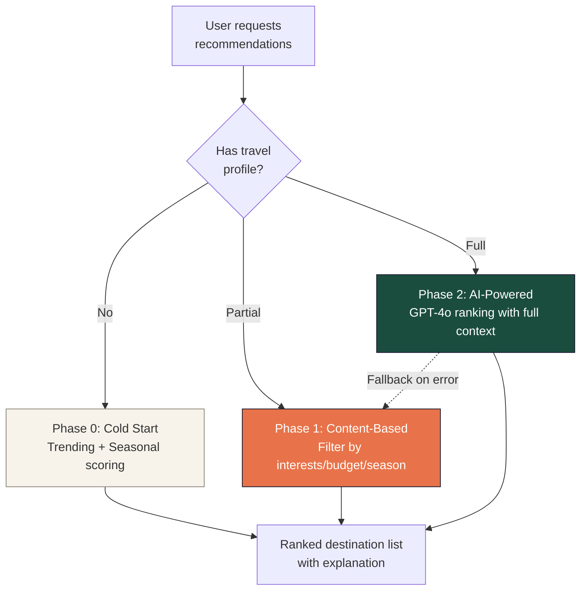

### State Management

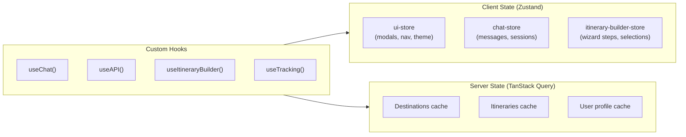

---

## Tech Stack

| Layer | Technology |
|-------|-----------|
| **Framework** | Next.js 16.1.6 (App Router, Turbopack) |
| **UI** | React 19, TailwindCSS 4, Radix UI, Framer Motion |
| **State** | Zustand 5 (client), TanStack Query 5 (server) |
| **AI** | OpenAI GPT-4o (streaming + structured output) |
| **ORM** | Prisma 7.4.1 |
| **Database** | Neon PostgreSQL (serverless) |
| **Cache** | Upstash Redis |
| **Auth** | NextAuth v5 (credentials + Google OAuth) |
| **Validation** | Zod 4.3.6 |
| **Forms** | React Hook Form 7 |
| **Maps** | Mapbox GL JS |
| **PDF** | @react-pdf/renderer |
| **Language** | TypeScript 5.7 |
| **Deployment** | Vercel |

---

## Project Structure

```
trails-and-miles/
├── prisma/
│   ├── schema.prisma              # 25+ models, 10 enums
│   ├── prisma.config.ts           # Prisma configuration
│   ├── seed.ts                    # Seed: 5 East Asian countries
│   ├── seed-phase2.ts             # Seed: Phase 2 extended data
│   └── seed-india.ts              # Seed: India (25 cities, 106 POIs)
├── src/
│   ├── app/
│   │   ├── (auth)/                # Auth pages (login, register)
│   │   ├── (main)/                # Main app pages
│   │   │   ├── page.tsx           # Homepage
│   │   │   ├── blog/              # Blog listing + detail
│   │   │   ├── destinations/      # Country + city detail pages
│   │   │   ├── experiences/       # Experiences listing
│   │   │   ├── itineraries/       # Itinerary list + detail + editor
│   │   │   ├── onboarding/        # Travel profile onboarding
│   │   │   ├── plan/              # Trip planning wizard
│   │   │   ├── profile/           # User profile
│   │   │   ├── search/            # Search results
│   │   │   ├── visa/              # Visa hub
│   │   │   └── weekend-getaways/  # Weekend getaways from metros
│   │   ├── api/                   # 18 API route handlers
│   │   ├── layout.tsx             # Root layout
│   │   ├── providers.tsx          # Client providers
│   │   ├── error.tsx              # Error boundary
│   │   ├── not-found.tsx          # 404 page
│   │   ├── robots.ts              # SEO robots.txt
│   │   └── sitemap.ts             # SEO sitemap.xml
│   ├── components/
│   │   ├── chat/                  # AI chatbot (7 components)
│   │   ├── home/                  # Homepage sections (10 components)
│   │   ├── india/                 # India-specific (3 components)
│   │   ├── itinerary/             # Itinerary display (7 components)
│   │   ├── layout/                # Header, footer, nav (6 components)
│   │   ├── onboarding/            # Onboarding wizard (6 components)
│   │   ├── plan/                  # Planning wizard (8 components)
│   │   ├── shared/                # Reusable cards & UI (19 components)
│   │   └── ui/                    # Radix primitives (10 components)
│   ├── lib/
│   │   ├── ai/openai.ts           # OpenAI client + streaming + RAG prompts
│   │   ├── cache/redis.ts         # Cache-aside pattern with fallback
│   │   ├── config/env.ts          # Zod-validated env vars
│   │   ├── data/                  # Static data (9 files)
│   │   ├── hooks/                 # Custom React hooks (4 hooks)
│   │   ├── services/              # Business logic (3 services)
│   │   ├── animations.ts          # Framer Motion presets
│   │   ├── api-utils.ts           # Response builders + error handlers
│   │   ├── auth.ts                # NextAuth helpers
│   │   ├── constants.ts           # App-wide constants
│   │   ├── db.ts                  # Prisma singleton
│   │   ├── unsplash.ts            # Curated image maps
│   │   ├── utils.ts               # Utility functions
│   │   └── validators.ts          # Zod schemas
│   ├── stores/                    # Zustand stores (3 stores)
│   ├── types/index.ts             # Shared TypeScript types
│   └── middleware.ts              # Security headers + caching
├── next.config.ts
├── tailwind.config / globals.css  # TailwindCSS 4 (CSS-first)
├── tsconfig.json
├── package.json
└── .env.example
```

---

## Data Flow

### Page Rendering Strategy

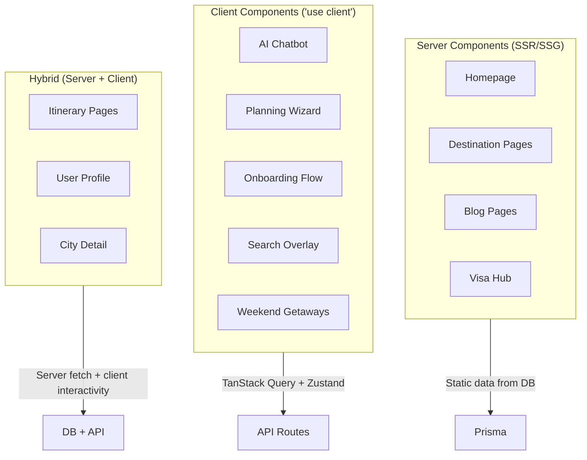

### Authentication Flow

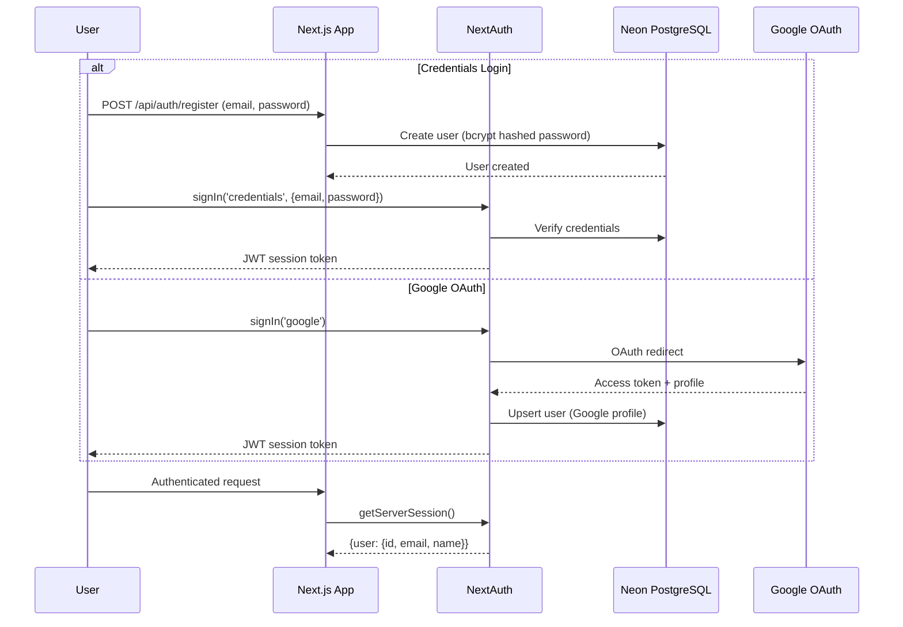

---

## API Routes

| Method | Endpoint | Auth | Description |
|--------|----------|------|-------------|
| POST | `/api/auth/register` | Public | Register new user |
| GET/POST | `/api/auth/[...nextauth]` | Public | NextAuth handlers |
| GET | `/api/destinations` | Public | List destinations (paginated, filterable) |
| GET | `/api/destinations/[slug]` | Public | Destination detail with cities + POIs |
| GET/POST/PUT/DELETE | `/api/itineraries` | Auth | Itinerary CRUD + AI generation |
| POST | `/api/itineraries/[slug]/regenerate-day` | Auth | Regenerate single itinerary day |
| POST | `/api/itineraries/[slug]/share` | Auth | Generate shareable link |
| POST | `/api/chat/stream` | Optional | OpenAI streaming chat (SSE) |
| POST | `/api/chatbot` | Optional | Legacy chatbot sessions + messages |
| GET | `/api/search` | Public | Unified search across all entities |
| GET | `/api/visa` | Public | Visa requirements for Indian passport |
| GET | `/api/recommendations` | Public | Trending recommendations |
| GET | `/api/recommendations/personalized` | Auth | AI-powered personalized recommendations |
| GET | `/api/recommendations/explain` | Auth | Recommendation explanation |
| POST | `/api/preferences/infer` | Auth | Infer preferences from context |
| GET/PATCH | `/api/users` | Auth | Profile + travel profile management |
| POST | `/api/analytics` | Optional | Track user events |

---

## Frontend Pages

### Main Application

| Route | Type | Description |
|-------|------|-------------|
| `/` | SSR | Homepage with hero, trending, explore India, experiences, visa glance |
| `/destinations` | SSR | All destinations grid with filters |
| `/destinations/[slug]` | SSR | Country page (India gets special treatment: region explorer, festivals, food guide, trains) |
| `/destinations/[slug]/[citySlug]` | SSR | City detail with POIs, map, food, transport |
| `/itineraries` | SSR | User's itineraries list |
| `/itineraries/[slug]` | Hybrid | Itinerary detail with day view, map, budget chart, PDF export |
| `/plan` | Client | Multi-step trip planning wizard (destination, dates, style, interests, review) |
| `/visa` | SSR | Visa hub for Indian passport holders |
| `/visa/[slug]` | SSR | Country visa detail with documents checklist |
| `/blog` | SSR | Travel blog listing |
| `/blog/[slug]` | SSR | Blog article detail |
| `/experiences` | SSR | Experience categories and listings |
| `/search` | Client | Full-text search across all entities |
| `/weekend-getaways` | Client | Weekend getaways from 6 Indian metros |
| `/onboarding` | Client | Travel profile onboarding quiz |
| `/profile` | Hybrid | User profile, preferences, travel history |

### Auth Pages

| Route | Description |
|-------|-------------|
| `/login` | Email/password + Google OAuth login |
| `/register` | New user registration |

---

## AI Pipeline

### Chat System

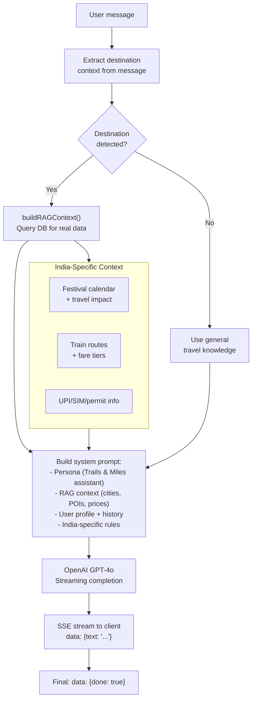

### RAG Context Builder

The context builder (`src/lib/services/context-builder.ts`) queries the database and formats real destination data into the AI system prompt:

1. **Country facts** — currency, language, timezone, safety, budget tier
2. **City data** — daily budget, food highlights, transport, safety tips
3. **POIs** — name, category, cost, duration, tags, ratings
4. **Visa info** — type, fees, processing time
5. **India extras** — upcoming festivals, train routes, UPI/permits info

---

## Database Schema

### Entity Relationship Overview

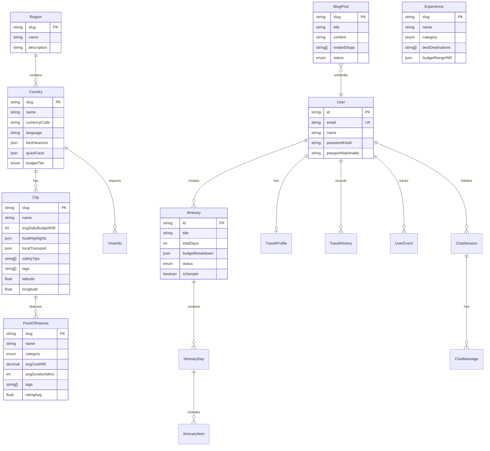

### Key Models (25+)

**Destinations**: Region, Country, City, PointOfInterest, VisaInfo, Experience
**User**: User, TravelProfile, TravelHistory, UserEvent, SavedItem
**Content**: BlogPost, BlogCategory
**Itinerary**: Itinerary, ItineraryDay, ItineraryItem, ItineraryCollaborator
**Chat**: ChatSession, ChatMessage
**Personalization**: UserPreference, RecommendationLog

---

## Getting Started

### Prerequisites

- Node.js 22+
- npm 10+
- PostgreSQL (Neon recommended) or local PostgreSQL
- OpenAI API key

### Setup

```bash
# Clone the repository
git clone git@github.com:sumith1309/Travel-Itinerary.git
cd Travel-Itinerary

# Install dependencies
npm install

# Configure environment
cp .env.example .env
# Fill in:
#   DATABASE_URL        - Neon PostgreSQL connection string
#   NEXTAUTH_SECRET     - Random secret (openssl rand -base64 32)
#   OPENAI_API_KEY      - OpenAI API key
#   GOOGLE_CLIENT_ID    - (Optional) Google OAuth
#   GOOGLE_CLIENT_SECRET

# Push schema to database
npx prisma db push

# Generate Prisma client
npx prisma generate

# Seed base data (5 East Asian countries)
npm run db:seed

# Seed India data (25 cities, 106 POIs)
npm run db:seed-india

# Start development server
npm run dev
```

Visit [http://localhost:3000](http://localhost:3000).

### Environment Variables

| Variable | Required | Description |
|----------|----------|-------------|
| `DATABASE_URL` | Yes | Neon PostgreSQL connection string |
| `NEXTAUTH_SECRET` | Yes | JWT signing secret |
| `OPENAI_API_KEY` | Yes | OpenAI API key for GPT-4o |
| `GOOGLE_CLIENT_ID` | No | Google OAuth client ID |
| `GOOGLE_CLIENT_SECRET` | No | Google OAuth client secret |
| `UPSTASH_REDIS_REST_URL` | No | Upstash Redis URL (caching) |
| `UPSTASH_REDIS_REST_TOKEN` | No | Upstash Redis token |
| `MAPBOX_ACCESS_TOKEN` | No | Mapbox GL JS token (maps) |

---

## Scripts

```bash
npm run dev              # Start dev server (Turbopack) — localhost:3000
npm run build            # Production build (type-checks + compiles)
npm run start            # Start production server
npm run lint             # ESLint
npm run type-check       # TypeScript check (no emit)

# Database
npm run db:generate      # Generate Prisma client
npm run db:push          # Push schema to database
npm run db:migrate       # Create + apply migrations
npm run db:seed          # Seed 5 East Asian countries
npm run db:seed-india    # Seed India (25 cities, 106 POIs, 15 experiences)
npm run db:studio        # Open Prisma Studio GUI
```

---

## Deployment

### Vercel (Recommended)

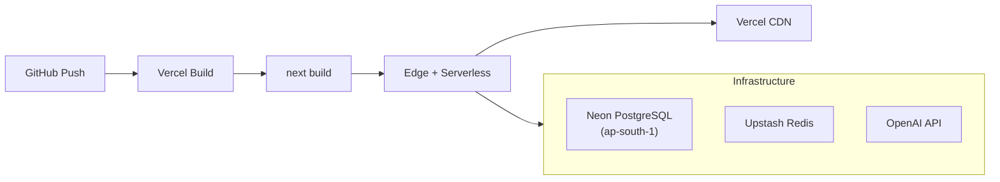

1. Connect GitHub repo to Vercel
2. Set environment variables in Vercel dashboard
3. Deploy — Vercel auto-detects Next.js
4. Run `npx prisma db push` and seed scripts against production DB

### Performance Targets

| Metric | Target |
|--------|--------|
| LCP | < 1.5s |
| FID | < 50ms |
| CLS | < 0.05 |
| INP | < 150ms |
| TTFB | < 200ms |
| JS Bundle | < 120KB gzipped |
| API p95 | < 300ms |
| Availability | 99.9% SLO |

---

## Roadmap

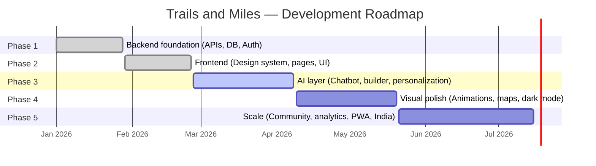

| Phase | Status | Highlights |
|-------|--------|------------|
| **Phase 1** | Done | 25+ Prisma models, 18 API routes, auth, Redis caching, AI service |
| **Phase 2** | Done | Design system, 17 pages, 95+ components, 6 countries, India domestic |
| **Phase 3** | Next | AI chatbot UI, itinerary builder wizard, onboarding quiz, personalization engine |
| **Phase 4** | Planned | Framer Motion animations, 3D cards, Mapbox maps, dark mode polish |
| **Phase 5** | Planned | Community features, analytics (Mixpanel), PWA, launch hardening |

---

## Design System

### Colors

| Token | Hex | Usage |
|-------|-----|-------|
| `brand-forest` | `#1B4D3E` | Primary brand, CTAs |
| `brand-orange` | `#E8734A` | Accent, highlights |
| `brand-sand` | `#F7F3EB` | Backgrounds |
| `brand-stone` | `#8B8578` | Secondary text |
| `brand-midnight` | `#1A1A2E` | Headings, primary text |
| `accent-green` | `#2C7A5B` | Success, links |

### Typography

| Role | Font | Usage |
|------|------|-------|
| Display | Playfair Display | Headings, hero text |
| Body | Outfit | UI text, paragraphs |
| Data | JetBrains Mono | Prices, codes, stats |

### Component Patterns

- **Cards**: `.neu-raised` (neumorphic elevated), `.neu-flat` (subtle), `.glass` (glassmorphism)
- **Animations**: `ScrollReveal` wrapper, `whileHover` spring effects, staggered children
- **Layout**: White-space heavy, card-based, progressive disclosure

---

## Data Coverage

| Entity | International | India | Total |
|--------|--------------|-------|-------|
| Countries | 5 (Vietnam, Thailand, Indonesia, Singapore, Maldives) | 1 | 6 |
| Cities | 11 | 25 | 36 |
| Points of Interest | ~30 | 106 | ~136 |
| Experiences | 6 | 15 | 21 |
| Sample Itineraries | 3 | 5 | 8 |
| Blog Posts | 5 | 8 | 13 |
| Weekend Getaways | — | 28 (from 6 metros) | 28 |
| Train Routes | — | 14 | 14 |
| Festivals | — | 15 | 15 |

---

## Contributing

1. Create a feature branch from `main`
2. Follow existing code patterns (see `CLAUDE.md` for conventions)
3. Ensure `npm run build` passes with zero errors
4. Submit a pull request

---

## License

Private — All rights reserved.

---

Built with care for Indian travellers.
